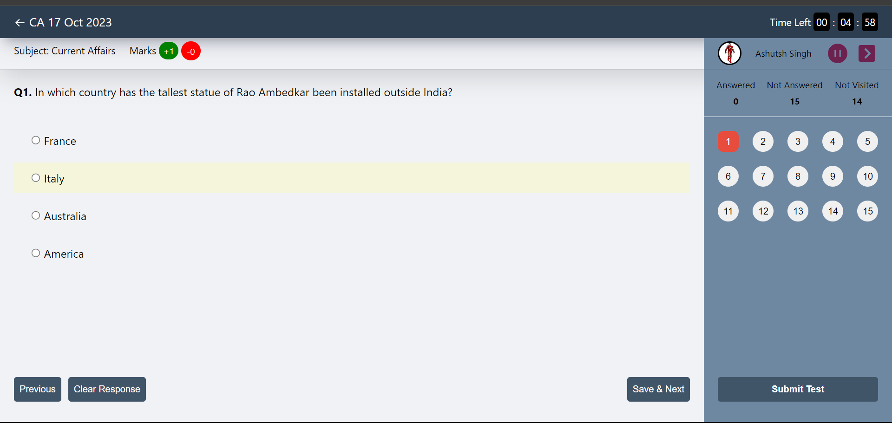

  <figure style="border-radius: 50%; height: 150px; width: 150px; overflow: hidden;">
    
  </figure>
  <h1>Hello, I'm Ashutosh Singh</h1>
  <h2>Full Stack Developer</h2>

  

  <a href="" style=" background-color:#fff;color:#000; padding: 5px 5px; border-radius: 3px">Resume</a>
  <a href="" style=" background-color:#fff;color:#000; padding: 5px 5px; border-radius: 3px">Contact Me</a>

  

<h2 style="text-align:center">Projects</h2>

<figure style="flex:1">

</figure>

  <h3>Quizkosh Web App</h3>
  
Tracks the number of users checking in and out of the library.

  

  React
  Nodejs
  MongoDB
  

  

  <a href="" style="color: #fff; background-color: orange; padding: 0.3rem 0.6rem">Code</a>
  <a href="" style="color: #fff; background-color: orange; padding: 0.3rem 0.6rem">Live</a>
  

